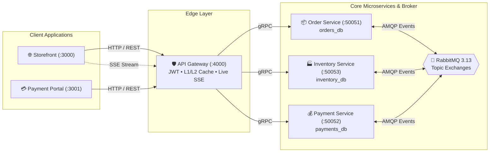

<div align="center">

# ⚡ Hermex
### Distributed E-Commerce & Logistics Ecosystem

[ **English** ] &nbsp;•&nbsp; [ [Українська](README.ua.md) ] &nbsp;•&nbsp; [ [GitHub Organization](https://github.com/HermexHub) ]

<p align="center">
  Event-Driven Architecture &bull; Choreography Saga &bull; Database-per-Service &bull; AppSec &amp; PCI-DSS Ready
</p>

</div>

---

> **Hermex** is a high-throughput, distributed microservices platform for consumer electronics e-commerce and courier delivery logistics.  
> Engineered adhering to **Clean Architecture**, **12-Factor App**, **Choreography-based Saga** (Eventual Consistency), end-to-end telemetry (**Distributed Tracing & Prometheus Metrics**), and strict Application Security (**AppSec / OWASP / PCI-DSS**).

---

### 🧭 Quick Navigation

| 📖 Architecture & Design | 💻 Client Applications | ⚙️ Infrastructure & Ops |
| :--- | :--- | :--- |
| • [Saga Choreography Flow](architecture/saga-flow.md)<br/>• [Network Topology & Ports](architecture/network-topology.md)<br/>• [Security & AppSec Baseline](architecture/security-baseline.md) | • [Storefront Website (:3000)](frontend-showcase.md#1-hermex-storefront-website)<br/>• [Hosted Payment Portal (:3001)](frontend-showcase.md#2-hermexpay-hosted-checkout-payment-portal)<br/>• [UI Screenshots Gallery](screenshots/README.md) | • [Quickstart Guide](#-quickstart-guide)<br/>• [Service Directory Table](#-service-directory--github-repositories)<br/>• [Docker Shared Platform](../docker/README.md) |

---

## 🏛️ System Architecture

The platform is designed around decentralized microservices with strict data isolation (**Database-per-Service**) and asynchronous messaging via **RabbitMQ 3.13**. Synchronous internal queries utilize **gRPC** over high-performance Protocol Buffers.



---

## 📂 Service Directory & GitHub Repositories

All Hermex platform components are organized in isolated standalone repositories under the official GitHub organization **[`HermexHub`](https://github.com/HermexHub)**:

| Component / Service | Type / Responsibility | Technology Stack | Ports / Protocols | GitHub Repository |
| :--- | :--- | :--- | :--- | :--- |
| **`website`** | Client Storefront | Next.js 15 (App Router), Tailwind CSS, Zustand, Lucide | HTTP `:3000` | [🔗 HermexHub/website](https://github.com/HermexHub/website) |
| **`payment-portal`** | Hosted Checkout | Next.js 15, Tailwind CSS, Lucide, 3D EMV Card Visualizer | HTTP `:3001` | [🔗 HermexHub/payment-portal](https://github.com/HermexHub/payment-portal) |
| **`api-gateway`** | API Gateway & Ingress | NestJS 10, Bun, TypeORM, Redis 7, Helmet, SSE | HTTP `:4000` | [🔗 HermexHub/api-gateway](https://github.com/HermexHub/api-gateway) |
| **`order-service`** | Core Microservice | NestJS 10, Bun, TypeORM, PostgreSQL, RabbitMQ | gRPC `:50051`<br/>Metrics `:3001` | [🔗 HermexHub/order-service](https://github.com/HermexHub/order-service) |
| **`inventory-service`** | Core Microservice | NestJS 10, Bun, TypeORM, PostgreSQL (JSONB + GIN) | gRPC `:50053`<br/>Metrics `:3002` | [🔗 HermexHub/inventory-service](https://github.com/HermexHub/inventory-service) |
| **`payment-service`** | Core Microservice | NestJS 10, Bun, TypeORM, PostgreSQL, Idempotency | gRPC `:50052`<br/>Metrics `:3003` | [🔗 HermexHub/payment-service](https://github.com/HermexHub/payment-service) |
| **`contracts`** | Shared Library | TypeScript, Protobuf, NPM Package (`@hermex/contracts`) | NPM / CI/CD | [🔗 HermexHub/contracts](https://github.com/HermexHub/contracts) |
| **`core`** | Shared Library | TypeScript, Pino Logger, TraceContext, NPM (`@hermex/core`) | NPM / CI/CD | [🔗 HermexHub/core](https://github.com/HermexHub/core) |
| **`docker`** | Shared Infrastructure | Docker Compose (PostgreSQL, Redis, RabbitMQ, ELK, Prometheus) | Docker Network | [🔗 HermexHub/docker](https://github.com/HermexHub/docker) |

---

## 🔄 Saga Choreography: Distributed Transactions

Hermex executes distributed order creation and payment settlement workflows without a centralized orchestrator via asynchronous RabbitMQ events:

### 1. Happy Path Workflow:
1. **Client** submits `POST /api/v1/orders` to **API Gateway**.
2. **Order Service** saves order with status `PENDING` and publishes `order.created`.
3. **Inventory Service** consumes `order.created`, reserves requested items in warehouse inventory, and publishes `inventory.reserved`.
4. **Payment Service** consumes `inventory.reserved` (or receives explicit payment trigger from the hosted checkout), captures funds idempotently, and publishes `payment.succeeded`.
5. **Order Service** consumes `payment.succeeded` and transitions order status to `CONFIRMED`.
6. **API Gateway** listens to RabbitMQ status events and pushes live updates to the browser via **SSE** (`GET /api/v1/orders/:id/live`).

### 2. Compensating Rollbacks:
- **Insufficient Warehouse Stock:**  
  `Inventory Service` publishes `inventory.failed` ➔ `Order Service` cancels the order (`status: CANCELLED`).
- **Payment Decline (insufficient funds, expired card, bank refusal):**  
  `Payment Service` publishes `payment.failed` ➔ `Inventory Service` executes a compensating restock transaction (`inventory.compensation.completed`) ➔ `Order Service` cancels the order (`status: CANCELLED`).

> For detailed sequence diagrams and event schemas, see [Saga Flow Architecture](architecture/saga-flow.md).

---

## 🚀 Quickstart Guide

### Prerequisites:
- [Bun](https://bun.sh) (v1.1+)
- [Docker & Docker Compose](https://www.docker.com/) (v24+)
- Node.js (v20+, optional)

### Step 1. Start Shared Infrastructure
```bash
# Navigate to the infrastructure folder and launch platform containers
cd docker
docker compose up -d

# Verify services:
# - PostgreSQL 16 (port 5432)
# - Redis 7 (port 6379)
# - RabbitMQ 3.13 (ports 5672, 15672)
# - Prometheus (port 9090)
# - Grafana (port 3000)
```

### Step 2. Seed Warehouse Catalog
```bash
# Populate 60 flagship consumer electronics products with GIN specs and i18n
docker exec -i hermex-postgres psql -U hermex -d inventory_db < seed-inventory.sql
```

### Step 3. Launch Backend Microservices
In each microservice directory (`api-gateway`, `order-service`, `inventory-service`, `payment-service`):
```bash
cd <service-name>
bun install
bun run start:dev
```
*Or containerized via local Docker Compose:*
```bash
docker compose up -d --build
```

### Step 4. Launch Frontend Applications
```bash
# Launch the client storefront
cd website
bun install
bun dev  # Available at http://localhost:3000

# Launch the hosted payment portal
cd payment-portal
bun install
bun dev  # Available at http://localhost:3001
```

---

## 📊 Developer Endpoints & Port Reference

| Service / Interface | URL | Access / Credentials |
| :--- | :--- | :--- |
| **Hermex Storefront** | [http://localhost:3000](http://localhost:3000) | Public access (Quick Login in navbar) |
| **HermexPay Checkout** | [http://localhost:3001](http://localhost:3001) | Contextual access (`/pay/:orderId`) |
| **API Gateway Swagger UI** | [http://localhost:4000/docs](http://localhost:4000/docs) | Interactive OpenAPI 3.0 Documentation |
| **RabbitMQ Management UI** | [http://localhost:15672](http://localhost:15672) | `guest` / `guest` |
| **Grafana Dashboards** | [http://localhost:3000](http://localhost:3000) | `admin` / `admin` |
| **Prometheus Telemetry** | [http://localhost:9090](http://localhost:9090) | Service metric scrapers |
| **Kibana Log Viewer** | [http://localhost:5601](http://localhost:5601) | Structured JSON logs with `x-correlation-id` |

---

## 🛡️ Security Baseline & OWASP / PCI-DSS Standards

- **OWASP Anti-Enumeration (CWE-204):** Uniform authentication responses (`Invalid email or password`).
- **Anti-Timing Attacks:** Execution time normalized via constant-time `DUMMY_HASH` (bcrypt) comparison.
- **Error Masking (CWE-209):** Internal stack traces and SQL queries concealed in production (`500 Internal server error`).
- **PCI-DSS Compliance:** CVVs and full card numbers never stored or logged. Sensitive fields redacted in `HermexLogger`.
- **Stateless Token Revocation:** Instant user logout and session revocation via atomic `token_version` increment.

---
