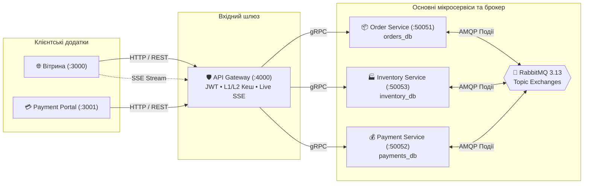

<div align="center">

# ⚡ Hermex
### Розподілена екосистема електронної комерції та логістики

[ [English](README.md) ] &nbsp;•&nbsp; [ **Українська** ] &nbsp;•&nbsp; [ [Організація GitHub](https://github.com/HermexHub) ]

<p align="center">
  Event-Driven Архітектура &bull; Хореографія Saga &bull; Database-per-Service &bull; Стандарти AppSec та PCI-DSS
</p>

</div>

---

> **Hermex** — високонавантажена розподілена мікросервісна платформа для електронної комерції та кур'єрської доставки техніки.  
> Спроектована за принципами **Clean Architecture**, **12-Factor App**, **Choreography-based Saga** (Eventual Consistency), наскрізної спостережуваності (**Distributed Tracing & Prometheus Metrics**) та суворої безпеки додатків (**AppSec / OWASP / PCI-DSS**).

---

### 🧭 Швидка навігація

| 📖 Архітектура та дизайн | 💻 Клієнтські додатки | ⚙️ Інфраструктура та Ops |
| :--- | :--- | :--- |
| • [Хореографія подій Saga](architecture/saga-flow.ua.md)<br/>• [Мережева топологія та порти](architecture/network-topology.ua.md)<br/>• [Стандарти безпеки (AppSec)](architecture/security-baseline.ua.md) | • [Вітрина інтернет-магазину (:3000)](frontend-showcase.ua.md#1-вітрина-магазину-hermex-website)<br/>• [Платіжний портал (:3001)](frontend-showcase.ua.md#2-hermexpay-hosted-checkout-payment-portal)<br/>• [Галерея скріншотів UI](screenshots/README.ua.md) | • [Інструкція швидкого запуску](#-швидкий-запуск-системи-quickstart-guide)<br/>• [Каталог репозиторіїв](#-каталог-репозиторіїв-service-directory)<br/>• [Спільна інфраструктура Docker](../docker/README.ua.md) |

---

## 🏛️ Архітектура системи

Платформа побудована на базі децентралізованих мікросервісів з повною ізоляцією даних (**Database-per-Service**) та асинхронною комунікацією через брокер повідомлень **RabbitMQ 3.13**. Внутрішні синхронні запити реалізовані через **gRPC** на базі Protobuf-контрактів.



---

## 📂 Каталог репозиторіїв (Service Directory)

Усі компоненти екосистеми Hermex підтримуються в окремих репозиторіях організації GitHub **[`HermexHub`](https://github.com/HermexHub)**:

| Компонент / Сервіс | Тип / Роль | Технологічний стек | Порти / Протоколи | Репозиторій GitHub |
| :--- | :--- | :--- | :--- | :--- |
| **`website`** | Клієнтська вітрина | Next.js 15 (App Router), Tailwind CSS, Zustand, Lucide | HTTP `:3000` | [🔗 HermexHub/website](https://github.com/HermexHub/website) |
| **`payment-portal`** | Hosted Checkout | Next.js 15, Tailwind CSS, Lucide, 3D EMV Card Visualizer | HTTP `:3001` | [🔗 HermexHub/payment-portal](https://github.com/HermexHub/payment-portal) |
| **`api-gateway`** | Вхідний шлюз | NestJS 10, Bun, TypeORM, Redis 7, Helmet, SSE | HTTP `:4000` | [🔗 HermexHub/api-gateway](https://github.com/HermexHub/api-gateway) |
| **`order-service`** | Мікросервіс замовлень | NestJS 10, Bun, TypeORM, PostgreSQL, RabbitMQ | gRPC `:50051`<br/>Metrics `:3001` | [🔗 HermexHub/order-service](https://github.com/HermexHub/order-service) |
| **`inventory-service`** | Мікросервіс складу | NestJS 10, Bun, TypeORM, PostgreSQL (JSONB + GIN) | gRPC `:50053`<br/>Metrics `:3002` | [🔗 HermexHub/inventory-service](https://github.com/HermexHub/inventory-service) |
| **`payment-service`** | Мікросервіс платежів | NestJS 10, Bun, TypeORM, PostgreSQL, Idempotency | gRPC `:50052`<br/>Metrics `:3003` | [🔗 HermexHub/payment-service](https://github.com/HermexHub/payment-service) |
| **`contracts`** | Спільна бібліотека | TypeScript, Protobuf, NPM-пакет (`@hermex/contracts`) | NPM / CI/CD | [🔗 HermexHub/contracts](https://github.com/HermexHub/contracts) |
| **`core`** | Спільна бібліотека | TypeScript, Pino Logger, TraceContext, NPM (`@hermex/core`) | NPM / CI/CD | [🔗 HermexHub/core](https://github.com/HermexHub/core) |
| **`docker`** | Базова інфраструктура | Docker Compose (PostgreSQL, Redis, RabbitMQ, ELK, Prometheus) | Docker Network | [🔗 HermexHub/docker](https://github.com/HermexHub/docker) |

---

## 🔄 Патерн Saga: Хореографія розподілених транзакцій

У платформі Hermex створення та оплата замовлення виконується без централізованого оркестратора через асинхронні події брокера RabbitMQ:

### 1. Успішний сценарій (Happy Path):
1. **Клієнт** відправляє `POST /api/v1/orders` до **API Gateway**.
2. **Order Service** зберігає замовлення зі статусом `PENDING` та публікує подію `order.created`.
3. **Inventory Service** читає `order.created`, резервує товар на складі та публікує `inventory.reserved`.
4. **Payment Service** слухає `inventory.reserved` (або отримує підтвердження від платіжного шлюзу), списує кошти та публікує `payment.succeeded`.
5. **Order Service** слухає `payment.succeeded` та оновлює статус замовлення на `CONFIRMED`.
6. **API Gateway** слухає події RabbitMQ та стрімить оновлення клієнту у браузер через **SSE** (`GET /api/v1/orders/:id/live`).

### 2. Компенсуючі транзакції (Rollback Path):
- **Нестача товару на складі:**  
  `Inventory Service` публікує `inventory.failed` ➔ `Order Service` скасовує замовлення (`status: CANCELLED`).
- **Помилка платежу (недостатньо коштів, картка прострочена, відмова банку):**  
  `Payment Service` публікує `payment.failed` ➔ `Inventory Service` повертає товар на баланс складу (`inventory.compensation.completed`) ➔ `Order Service` скасовує замовлення (`status: CANCELLED`).

> Детальні sequence-діаграми та типи подій дивіться у [Saga Flow Architecture](architecture/saga-flow.ua.md).

---

## 🚀 Швидкий запуск системи (Quickstart Guide)

### Вимоги:
- [Bun](https://bun.sh) (v1.1+)
- [Docker & Docker Compose](https://www.docker.com/) (v24+)
- Node.js (v20+, опціонально)

### Крок 1. Запуск базової інфраструктури
```bash
# Переходимо в інфраструктурну директорію та запускаємо спільні сервіси
cd docker
docker compose up -d

# Перевіряємо запущені контейнери:
# - PostgreSQL 16 (порт 5432)
# - Redis 7 (порт 6379)
# - RabbitMQ 3.13 (порти 5672, 15672)
# - Prometheus (порт 9090)
# - Grafana (порт 3000)
```

### Крок 2. Наповнення каталогу товарів (Seed Inventory)
```bash
# Завантажуємо 60 флагманських товарів електроніки зі специфікаціями GIN та i18n
docker exec -i hermex-postgres psql -U hermex -d inventory_db < seed-inventory.sql
```

### Крок 3. Запуск мікросервісів бекенду
Для кожного мікросервісу (`api-gateway`, `order-service`, `inventory-service`, `payment-service`):
```bash
cd <service-name>
bun install
bun run start:dev
```
*Або через локальний Docker Compose у кожній папці:*
```bash
docker compose up -d --build
```

### Крок 4. Запуск клієнтських додатків (Frontend)
```bash
# Запуск головної вітрини магазину (Storefront)
cd website
bun install
bun dev  # Доступно за адресою http://localhost:3000

# Запуск платіжного шлюзу (Payment Portal)
cd payment-portal
bun install
bun dev  # Доступно за адресою http://localhost:3001
```

---

## 📊 Доступні інтерфейси та посилання

| Сервіс / Панель | URL | Доступ / Облікові дані |
| :--- | :--- | :--- |
| **Hermex Storefront** | [http://localhost:3000](http://localhost:3000) | Публічний доступ (Quick Login у шапці) |
| **HermexPay Checkout** | [http://localhost:3001](http://localhost:3001) | Контекстний доступ (`/pay/:orderId`) |
| **API Gateway Swagger UI** | [http://localhost:4000/docs](http://localhost:4000/docs) | Інтерактивна OpenAPI документація |
| **RabbitMQ Management UI** | [http://localhost:15672](http://localhost:15672) | `guest` / `guest` |
| **Grafana Dashboards** | [http://localhost:3000](http://localhost:3000) | `admin` / `admin` |
| **Prometheus Telemetry** | [http://localhost:9090](http://localhost:9090) | Збір метрик мікросервісів |
| **Kibana Log Explorer** | [http://localhost:5601](http://localhost:5601) | Пошук у логах із `x-correlation-id` |

---

## 🛡️ Стандарти безпеки (Security Baseline)

- **OWASP Anti-Enumeration (CWE-204):** Єдині знеособлені відповіді при спробі входу (`Invalid email or password`).
- **Захист від атак за часом (Anti-Timing Attacks):** Порівняння за постійний час за допомогою `DUMMY_HASH` (bcrypt).
- **Маскування помилок (CWE-209):** Повне приховування стек-трейсів та SQL-запитів у продакшені (`500 Internal server error`).
- **PCI-DSS Compliance:** Заборона збереження та логування CVV і повних номерів карток. Маскування у `HermexLogger`.
- **Stateless Token Revocation:** Миттєвий вихід та відкликання сесій через інкремент `token_version` у базі даних.

---
