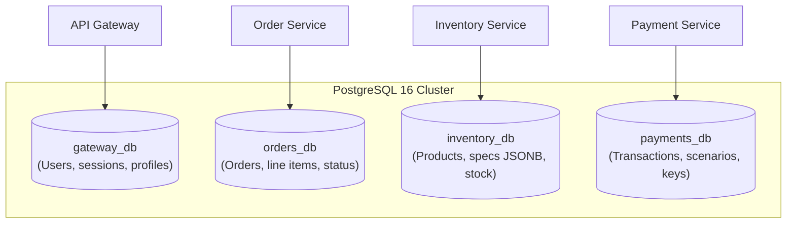

<div align="center">

# 🔌 Network Topology & Infrastructure Matrix
### Ports, Internal Protocols & Inter-Service Communications

[ **English** ] &nbsp;•&nbsp; [ [Українська](network-topology.ua.md) ] &nbsp;•&nbsp; [ [System Overview](../README.md) ]

</div>

This document specifies the network interactions, protocols, databases, and message broker configuration across the Hermex microservices ecosystem.

---

## 🧭 1. Port & Protocol Matrix

| Service / Component | Docker Container | Internal Container Port | Host Port | Protocol / Purpose |
| :--- | :--- | :---: | :---: | :--- |
| **Hermex Website** | `hermex-website` | `3000` | `3000` | HTTP / Storefront UI |
| **Payment Portal** | `hermex-payment-portal`| `3001` | `3001` | HTTP / Hosted Checkout |
| **API Gateway** | `hermex-api-gateway` | `4000` | `4000` | HTTP / Ingress & Live SSE |
| **Order Service** | `hermex-order-service` | `50051`<br/>`3001` | *Isolated*<br/>*Isolated* | gRPC (Internal RPC)<br/>HTTP (`/metrics`) |
| **Inventory Service**| `hermex-inventory-service`| `50053`<br/>`3002` | *Isolated*<br/>*Isolated* | gRPC (Internal RPC)<br/>HTTP (`/metrics`) |
| **Payment Service** | `hermex-payment-service`| `50052`<br/>`3003` | *Isolated*<br/>*Isolated* | gRPC (Internal RPC)<br/>HTTP (`/metrics`) |
| **PostgreSQL 16** | `hermex-postgres` | `5432` | `5432` | TCP / Relational DBMS |
| **Redis 7** | `hermex-redis` | `6379` | `6379` | TCP / Cache & Deduplication |
| **RabbitMQ 3.13** | `hermex-rabbitmq` | `5672`<br/>`15672` | `5672`<br/>`15672` | AMQP 0-9-1<br/>HTTP Management UI |
| **Prometheus** | `hermex-prometheus` | `9090` | `9090` | HTTP / Metrics Scraper |
| **Grafana** | `hermex-grafana` | `3000` | `3000` (Docker) | HTTP / Dashboards |
| **Kibana (ELK)** | `hermex-kibana` | `5601` | `5601` | HTTP / Log Analytics |
| **Elasticsearch** | `hermex-elasticsearch` | `9200` | `9200` | HTTP / Telemetry Storage |

> [!NOTE]
> Adhering to **Security-by-Design**, gRPC ports (`50051`, `50052`, `50053`) and internal metrics ports (`3001`, `3002`, `3003`) **are never published to the host machine** in Docker Compose. They are accessible exclusively within the isolated `hermex-network` bridge.

---

## 🐘 2. Database Isolation (Database-per-Service)

A single PostgreSQL 16 cluster (`docker/init.sql`) provisions 4 logically isolated databases with dedicated schemas and credentials:



---

## 🐇 3. RabbitMQ Topology & Exchanges

```
[Exchanges]
  ├── order.topic (Topic Exchange)
  │     ├── order.created
  │     ├── order.cancelled
  │     └── order.expired
  │
  ├── inventory.topic (Topic Exchange)
  │     ├── inventory.reserved
  │     ├── inventory.failed
  │     └── inventory.compensation.completed
  │
  ├── payment.topic (Topic Exchange)
  │     ├── payment.succeeded
  │     └── payment.failed
  │
  ├── notifications.fanout (Fanout Exchange)
  │     └── [Broadcast to real-time notification listeners]
  │
  └── hermex.dlx (Dead Letter Exchange)
        └── hermex.dead.letter.queue (Poison message queue)
```

---

## 🌐 4. gRPC Service Definitions (`@hermex/contracts`)

- **`OrderGrpcService` (`order.proto` on `:50051`):**
  - `CreateOrder(CreateOrderRequest) -> CreateOrderResponse`
  - `GetOrderById(GetOrderByIdRequest) -> OrderMessage`
  - `CancelOrder(CancelOrderRequest) -> CancelOrderResponse`
- **`InventoryGrpcService` (`inventory.proto` on `:50053`):**
  - `GetProducts(GetProductsRequest) -> GetProductsResponse`
  - `GetProductById(GetProductByIdRequest) -> GetProductByIdResponse`
  - `ValidateCart(ValidateCartRequest) -> ValidateCartResponse`
- **`PaymentGrpcService` (`payment.proto` on `:50052`):**
  - `CreatePaymentSession(CreatePaymentSessionRequest) -> CreatePaymentSessionResponse`
  - `ProcessPayment(ProcessPaymentRequest) -> ProcessPaymentResponse`
