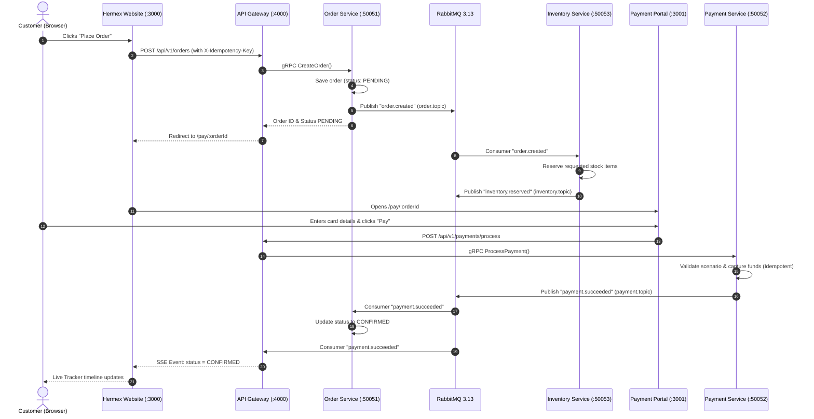
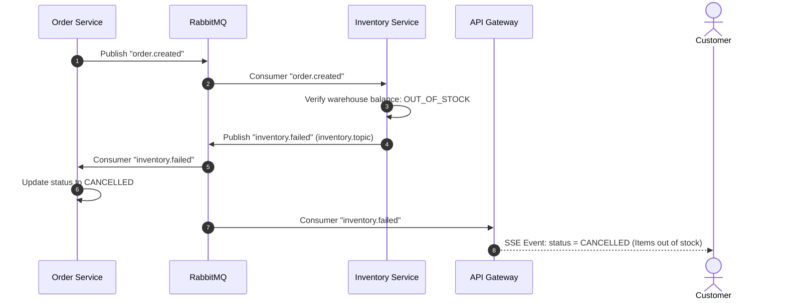
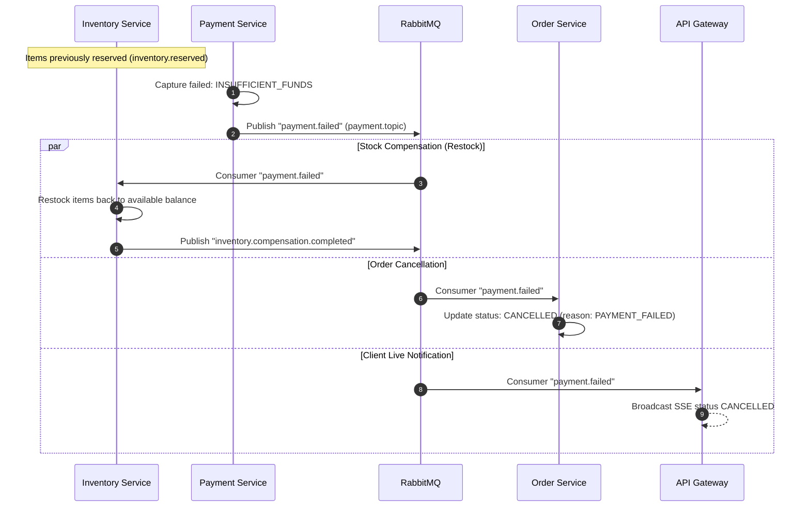

# 🔄 Hermex Saga Flow
### Choreography-Based Distributed Transactions & Compensations

[ **English** ] &nbsp;•&nbsp; [ [Українська](saga-flow.ua.md) ] &nbsp;•&nbsp; [ [System Overview](../README.md) ]

Hermex employs the **Choreography-based Saga** pattern to handle distributed transactions across independent microservices without a centralized coordinator (Orchestrator). Services interact through asynchronous events delivered by **RabbitMQ 3.13**, ensuring loose coupling and high horizontal scalability.

---

## 🧭 1. Happy Path: Order Creation & Payment Settlement

In the standard flow, an order sequentially transitions through stock reservation and funds capture:

---

## 🛑 2. Rollback Path 1: Insufficient Warehouse Stock (`inventory.failed`)

When items are out of stock during checkout:

---

## 💳 3. Rollback Path 2: Payment Failure & Compensating Restock

If payment is declined by the issuer bank or funds are insufficient, a compensating transaction executes to release reserved stock:

---

## 📜 4. Event Contracts (`@hermex/contracts`)

All events are strictly typed and published with mandatory `trace_id` headers:

| Event / Routing Key | Exchange | Payload Interface | Purpose |
| :--- | :--- | :--- | :--- |
| `order.created` | `order.topic` | `OrderCreatedPayload` | Order Saga initiation |
| `order.cancelled` | `order.topic` | `OrderCancelledPayload` | Order cancellation notification |
| `order.expired` | `order.topic` | `OrderExpiredPayload` | 15-minute reservation TTL expiration |
| `inventory.reserved` | `inventory.topic` | `InventoryReservedPayload` | Successful inventory reservation |
| `inventory.failed` | `inventory.topic` | `InventoryFailedPayload` | Reservation failure (out of stock) |
| `inventory.compensation.completed` | `inventory.topic` | `InventoryCompensationPayload` | Warehouse restock confirmation |
| `payment.succeeded` | `payment.topic` | `PaymentSucceededPayload` | Successful charge authorization |
| `payment.failed` | `payment.topic` | `PaymentFailedPayload` | Payment decline (reason, error code) |

---

## ⚡ 5. Idempotency & Fault Tolerance

1. **Idempotency Keys:** Every order and payment request carries an `X-Idempotency-Key` (UUIDv4) header.
2. **Deduplication in Redis 7:** The payment service validates the idempotency key in Redis with a 24-hour TTL before executing transactions.
3. **Dead Letter Queue (`hermex.dlx`):** Messages that fail processing 3 times (`nack(false)`) route to `hermex.dead.letter.queue` for incident investigation.
