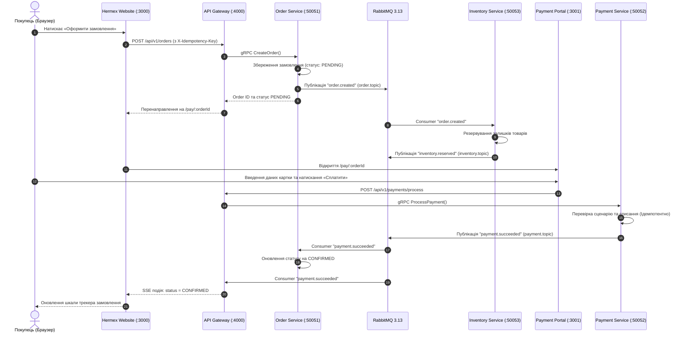
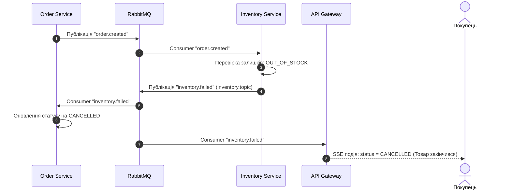
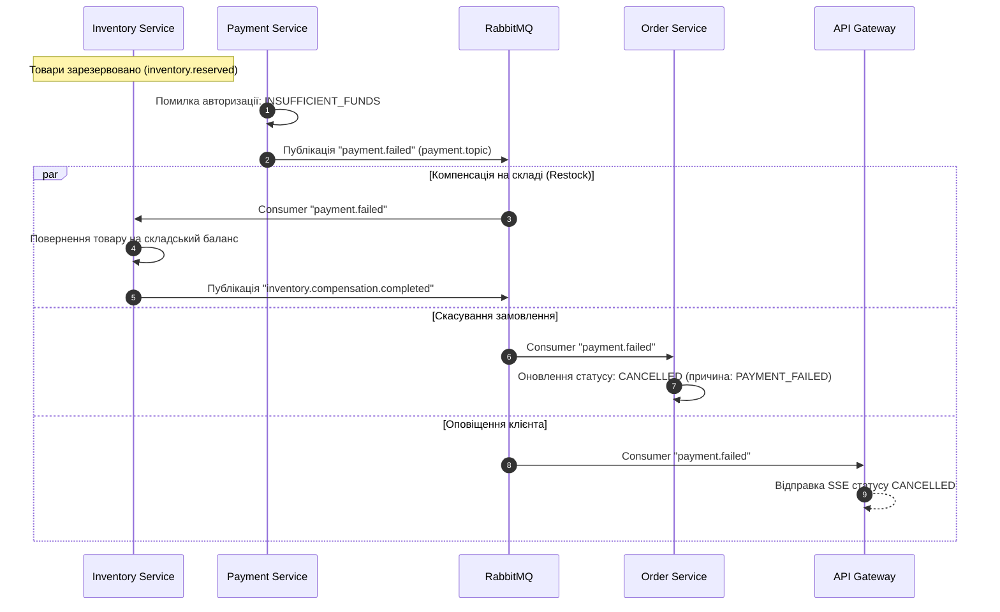

# 🔄 Розподілена Saga у Hermex
### Хореографія подій та компенсуючі транзакції

[ [English](saga-flow.md) ] &nbsp;•&nbsp; [ **Українська** ] &nbsp;•&nbsp; [ [Головний огляд](../README.ua.md) ]

Платформа Hermex використовує патерн **Choreography-based Saga** для управління розподіленими транзакціями між мікросервісами без централізованого координатора (Orchestrator). Сервіси взаємодіють через асинхронні події брокера **RabbitMQ 3.13**, що забезпечує слабку зв'язність та високу горизонтальну масштабованість.

---

## 🧭 1. Happy Path: Створення та оплата замовлення

У штатному сценарії замовлення послідовно проходить резервування на складі та списання коштів:

---

## 🛑 2. Rollback Path 1: Нестача товару на складі (`inventory.failed`)

Коли на складі недостатньо залишків під час оформлення:

---

## 💳 3. Rollback Path 2: Помилка платежу та компенсація залишків

Якщо платіж відхилено банком або на рахунку недостатньо коштів, запускається компенсуюча транзакція для повернення зарезервованого товару на баланс складу:

---

## 📜 4. Контракти подій (`@hermex/contracts`)

Усі події суворо типізовані та містять обов'язковий ідентифікатор `trace_id`:

| Подія / Routing Key | Обмінник (Exchange) | Інтерфейс пейлоаду | Призначення |
| :--- | :--- | :--- | :--- |
| `order.created` | `order.topic` | `OrderCreatedPayload` | Ініціація Saga створення замовлення |
| `order.cancelled` | `order.topic` | `OrderCancelledPayload` | Сповіщення про скасування замовлення |
| `order.expired` | `order.topic` | `OrderExpiredPayload` | Закінчення 15-хвилинного TTL резерву |
| `inventory.reserved` | `inventory.topic` | `InventoryReservedPayload` | Успішне резервування товарів |
| `inventory.failed` | `inventory.topic` | `InventoryFailedPayload` | Помилка резервування (товару немає) |
| `inventory.compensation.completed` | `inventory.topic` | `InventoryCompensationPayload` | Підтвердження повернення товару на склад |
| `payment.succeeded` | `payment.topic` | `PaymentSucceededPayload` | Успішна авторизація та списання коштів |
| `payment.failed` | `payment.topic` | `PaymentFailedPayload` | Відмова платежу (код помилки) |

---

## ⚡ 5. Ідемпотентність та стійкість до відмов

1. **Ключі ідемпотентності:** Кожен запит створення замовлення та оплати супроводжується заголовком `X-Idempotency-Key` (UUIDv4).
2. **Дедуплікація в Redis 7:** Сервіс платежів перевіряє ключ у Redis із TTL 24 години перед проведенням транзакції.
3. **Dead Letter Queue (`hermex.dlx`):** Повідомлення, що завершилися збоєм 3 рази поспіль (`nack(false)`), автоматично перенаправляються в чергу `hermex.dead.letter.queue`.
