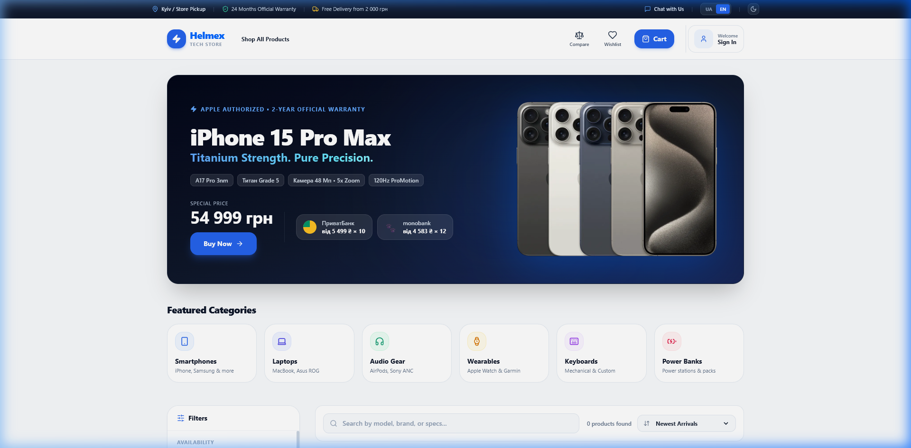
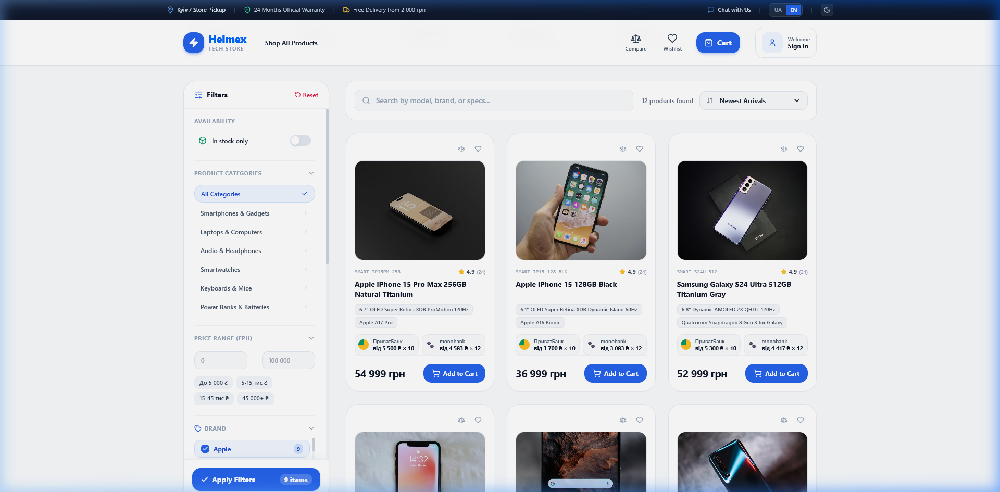
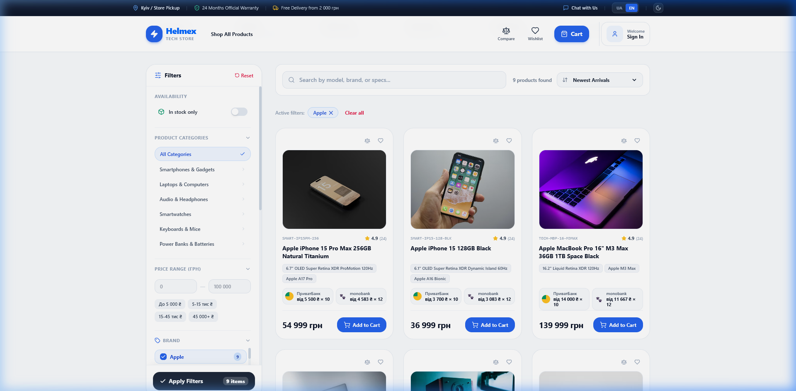
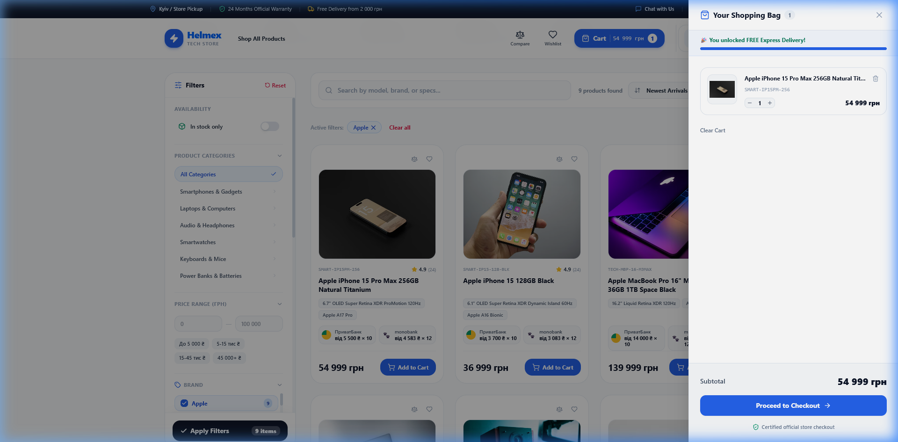
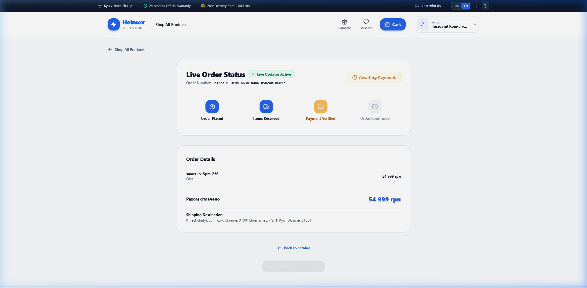
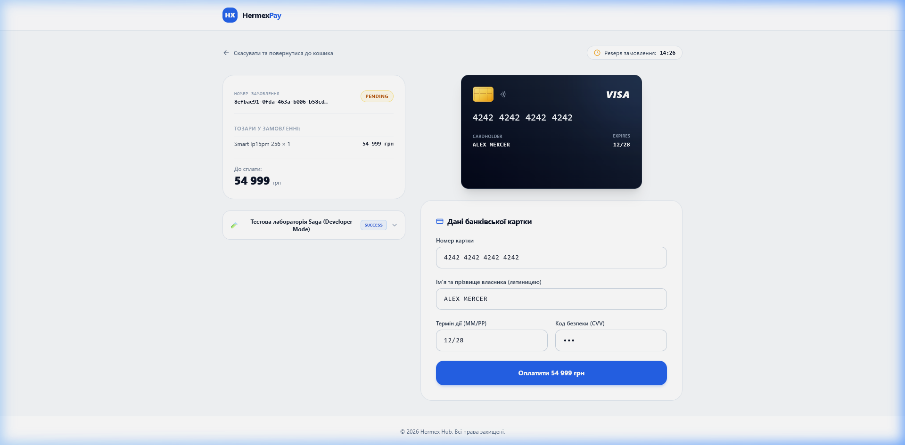

# 🎨 Візуальний огляд фронтенду Hermex
### UI/UX архітектура та галерея скріншотів інтерфейсу

[ [English](frontend-showcase.md) ] &nbsp;•&nbsp; [ **Українська** ] &nbsp;•&nbsp; [ [Головний огляд](README.ua.md) ] &nbsp;•&nbsp; [ [Галерея скріншотів](screenshots/README.ua.md) ]

  Next.js 14.2 &bull; Tailwind CSS &bull; 3D EMV-картка &bull; Server-Sent Events (SSE)

Цей документ містить детальний візуальний та архітектурний огляд двох незалежних клієнтських додатків екосистеми Hermex:
1. 🌐 **Hermex Storefront (`website`)** — Головна вітрина інтернет-магазину техніки та електроніки (порт `:3000`).
2. 💳 **HermexPay Hosted Checkout (`payment-portal`)** — Ізольований захищений платіжний шлюз (порт `:3001`).

---

## 📸 Галерея скріншотів інтерфейсу високої роздільної здатності

Усі скріншоти зняті безпосередньо з робочих запущених сервісів і збережені у папці [`screenshots/`](screenshots/):

| Скріншот | Опис функціональності | Компонент / Маршрут | Пряме посилання |
| :--- | :--- | :--- | :---: |
| `01_storefront_catalog.png` | Головна вітрина, каталог товарів, липка навігація та промо-банер | `website` (`/`) | [Переглянути](screenshots/01_storefront_catalog.png) |
| `02_faceted_filters.png` | Сайдбар фасетної фільтрації зі Staged Draft State та лічильником на кнопці | `website` (`/`) | [Переглянути](screenshots/02_faceted_filters.png) |
| `03_filtered_catalog.png` | Каталог, відфільтрований за брендом Apple з активними бейджами | `website` (`/`) | [Переглянути](screenshots/03_filtered_catalog.png) |
| `04_cart_drawer.png` | Шторка кошика з батч-валідацією цін та шкалою безкоштовної доставки | `website` (`CartDrawer`) | [Переглянути](screenshots/04_cart_drawer.png) |
| `05_payment_portal.png` | Світла тема Hosted Checkout з 3D EMV-карткою та панеллю тестування Saga | `payment-portal` (`/pay/[id]`) | [Переглянути](screenshots/05_payment_portal.png) |
| `06_live_order_tracker.png` | Екран відстеження замовлення в реальному часі через Live SSE | `website` (`/orders/[id]`) | [Переглянути](screenshots/06_live_order_tracker.png) |

---

## 🌐 1. Вітрина магазину Hermex (`website`)

- **Технологічний стек:** Next.js 15 (App Router), React 19, TypeScript, Tailwind CSS, Zustand, Lucide Icons
- **Адреса сервісу:** `http://localhost:3000`
- **GitHub репозиторій:** [🔗 HermexHub/website](https://github.com/HermexHub/website)

### Ключові архітектурні та UI/UX рішення:

### 1.1. Шапка сайту та навігація (Header & Navbar)
- **Glassmorphism Sticky Bar:** Ефект матового скла (`backdrop-blur-md`) з фіксацією при скролі.
- **Двомовний інтерфейс (i18n):** Миттєве перемикання між українською (`UA`) та англійською (`EN`) мовами без перезавантаження сторінки зі збереженням локалі.
- **Керування сесією:** Швидкий вхід в 1 клік **1-click Quick Login** (`test@gmail.com`), очищення імені від артефактів та інтерцептори автоматичного оновлення токенів.
- **Реактивний індикатор кошика:** Анімований бейдж кількості товарів із сумою в гривнях (₴).

### 1.2. Промо-банер флагманів (Hero Showcase)
- Безшовна композиція презентації флагманських пристроїв (Apple, Samsung, Asus, Sony).
- Чіпи технічних характеристик, офіційна гарантія 24 місяці та розстрочка 0%.

### 1.3. Інтелектуальна фасетна фільтрація (Sidebar Filters)

- **Ізольований скрол-контейнер:** Сайдбар прокручується незалежно, не розтягуючи сторінку.
- **Staged Draft State:** Чекбокси обираються без передчасних запитів до бекенду.
- **Динамічний лічильник:** Кнопка автоматично розраховує кількість знайдених товарів: `Застосувати (9 знайдено)`.
- **Характеристики з JSONB:** Слайдер цін, бренди (Apple, Asus, Sony, Samsung) та залізо (процесор, оперативна пам'ять, накопичувач).

### 1.4. Відфільтрований каталог товарів

- Миттєвий пошук завдяки PostgreSQL GIN-індексації характеристик.
- Зручні бейджі активних фільтрів (`Apple ✕`) зі швидким скасуванням.

### 1.5. Висувний кошик (Cart Drawer) та валідація цін

- **Client-Side First:** Zustand сховище з `localStorage` персистентністю та захистом від hydration mismatch.
- **Батч-валідація (`POST /api/v1/cart/validate`):** Єдиний gRPC-запит до `inventory-service` для перевірки наявності та актуальності цін при відкритті кошика.
- **Прогрес-бар безкоштовної доставки:** Візуальний індикатор безкоштовної експрес-доставки при сумі від 2 000 грн.

### 1.6. Оформлення замовлення (Checkout Flow)
- Контакти покупця та вибір доставки (Нова Пошта або кур'єр).
- Генерація унікального ключа `X-Idempotency-Key` (UUIDv4) для захисту від повторних списань.
- Безшовне перенаправлення на платіжний портал.

### 1.7. Live Order Tracker (Server-Sent Events)

- Пряме підключення до SSE-потоку API Gateway (`GET /api/v1/orders/:id/live`).
- Анімований степпер статусів замовлення:  
  `Очікує оплати (PENDING)` ➔ `Товари зарезервовано` ➔ `Оплату підтверджено` ➔ `Замовлення підтверджено (CONFIRMED)`.
- Автоматичний реконект з експоненційною затримкою.

---

## 💳 2. HermexPay Hosted Checkout (`payment-portal`)

- **Технологічний стек:** Next.js 15, React 19, TypeScript, Tailwind CSS, Lucide Icons
- **Адреса сервісу:** `http://localhost:3001`
- **GitHub репозиторій:** [🔗 HermexHub/payment-portal](https://github.com/HermexHub/payment-portal)

### Ключові архітектурні та UI/UX рішення:

### 2.1. Світла фінтех-тема (Стандарт Stripe)
- Преміальна світла естетика (`bg-slate-50` / `bg-white`), гармонійні межі та висока контрастність шрифтів.
- Усунено візуальний шум: прибрано застарілі dev-бейджі та додано стриманий текст довіри:  
  *«Безпечна оплата. Hermex не зберігає дані банківських карток.»*

### 2.2. Захищений сесійний маршрут
- Кореневий маршрут `/` безпечно перенаправляє на вітрину магазину `website`.
- Доступ відкрито виключно за валідним сесійним посиланням `/pay/[id]`.

### 2.3. Інтерактивна 3D-картка (`PaymentCardVisualizer`)
- Реалістичний металевий EMV-мікрочіп із золотистими доріжками контактів.
- Зручне компактне форматування 4-значними блоками: `4242 4242 4242 4242`.
- Плавний 3D-переворот картки зворотним боком при введенні CVV-коду.

### 2.4. Незбивний 15-хвилинний таймер резерву
- Відлік ведеться від серверного часу створення замовлення (`createdAt` + 15 хв).
- Синхронізація з годинником пристрою та збереження в `localStorage`.
- При натисканні **F5**, оновленні вкладки чи відкритті в новому вікні таймер **не скидається** на 15:00.
- Товари та сума зберігаються без блимання.

### 2.5. Згортана тестова лабораторія Saga (Developer Mode)
- Акуратний акордеон: `[ 🧪 Тестова лабораторія Saga (Developer Mode) ]`.
- Тестування всіх сценаріїв розподіленої транзакції в 1 клік:
  - `[ ✅ Успіх ]` ➔ `4242...4242` (`payment.succeeded` ➔ замовлення підтверджено).
  - `[ ❌ Недостатньо коштів ]` ➔ `4000...0002` (`payment.failed` ➔ повернення товару на склад ➔ скасування замовлення).
  - `[ 🚫 Картка прострочена ]` ➔ `4000...0003`.
  - `[ 🛑 Відхилено банком ]` ➔ `4000...0004`.
  - `[ ⏱️ Таймаут ]` ➔ `4000...0005`.

### 2.6. Модальне вікно процесингу та 3D-Secure
- Покрокова анімація авторизації (перевірка сесії ➔ зв'язок з банком ➔ фіксація платежу).
- Автоматичне повернення покупця до трекера замовлення на вітрині.
